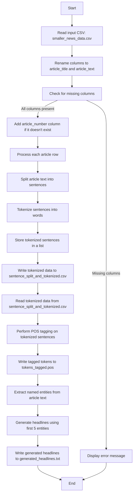

```mermaid
flowchart TD
    A[Start] --> B[Read input CSV: smaller_news_data.csv]
    B --> C[Rename columns to article_title and article_text]
    C --> D[Check for missing columns]
    D -->|Missing columns| E[Display error message]
    D -->|All columns present| F[Add article_number column if it doesn't exist]
    F --> G[Process each article row]
    G --> H[Split article text into sentences]
    H --> I[Tokenize sentences into words]
    I --> J[Store tokenized sentences in a list]
    J --> K[Write tokenized data to sentence_split_and_tokenized.csv]
    K --> L[Read tokenized data from sentence_split_and_tokenized.csv]
    L --> M[Perform POS tagging on tokenized sentences]
    M --> N[Write tagged tokens to tokens_tagged.pos]
    N --> O[Extract named entities from article text]
    O --> P[Generate headlines using first 5 entities]
    P --> Q[Write generated headlines to generated_headlines.txt]
    Q --> R[End]
    
    E --> R
```